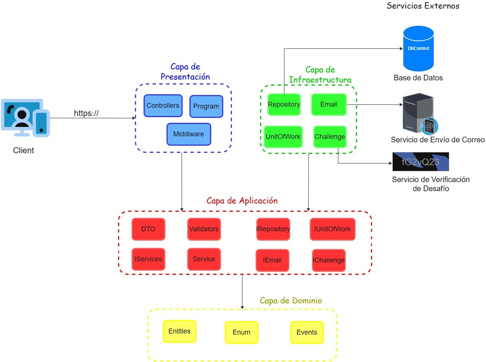

# Architecture - Finlay Pharmacovigilance Platform

## Overview

The Finlay Pharmacovigilance Platform is a full-stack web application implementing **Clean Architecture** with a layered design, designed to support the capture, validation, and tracking of adverse events following vaccination. The system addresses operational challenges in pharmacovigilance workflows through role-based access control, asynchronous notifications, and robust data integrity mechanisms.

### Implemented Use Cases

1. **Public Report Submission** - Citizens and healthcare professionals submit adverse event reports without pre-registration
2. **Medical Review & Validation** - Medical evaluators assess, enrich, and validate submitted reports
3. **Duplicate Detection** - Automatic comparison of vaccination records and event details across historical reports
4. **Report Assignment & Reassignment** - Section heads assign reports to medical reviewers with conflict detection
5. **Alert Escalation** - Automatic notifications to health areas based on report severity and subject location
6. **Audit Trail & Traceability** - Complete record of all operations for regulatory compliance

### System Architecture Diagram



---

## Architecture Layers

### Domain Layer
- **Pure business logic:** No external dependencies; independent of infrastructure
- **Entities:** `BasicEntity` base class unifies timestamps; `GuidEntity` (primary), `CatalogEntity` (references)
- **Value Objects:** Domain-specific types (e.g., `IdentityNumber`)
- **Key ID Strategy:** `Guid` (prevents enumeration, resilience), `int` only for stable catalog tables

### Application Layer
- **Use Case Orchestration:** Command and query services implementing CQRS
- **DTO Mapping:** AutoMapper with direct SQL projections via `ProjectTo<T>` (no N+1 queries)
- **Validation:** Two-level strategy (annotations → database validators)
- **Dependency Injection:** ASP.NET Core container, scoped per-request for transaction isolation

### Infrastructure Layer
- **Data Access:** Entity Framework Core 8 + MySQL 8.0 (Pomelo provider)
- **Patterns:** Generic Repository, Unit of Work with atomic batching
- **Concurrency:** Optimistic locking via `RowVersion` tokens
- **External Services:** Email (EmailJS), WhatsApp (OpenWA), Messaging (RabbitMQ + MassTransit)
- **Audit & Logging:** Interceptor-based audit trail, Serilog structured logs

### Presentation Layer
- **REST API:** Standard HTTP verbs, stateless, consistent JSON envelopes
- **Controllers:** Thin facades mapping HTTP to application layer
- **Documentation:** Swagger/OpenAPI (dev-only exposure)
- **Error Handling:** Centralized middleware mapping exceptions to HTTP status codes

---

## Design Patterns

### Command Query Responsibility Segregation (CQRS)
- **Separation:** Distinct interfaces for commands (writes) and queries (reads)
- **Benefit:** Prevents accidental queries within business logic; enables independent optimization of read/write paths
- **Implementation:** `IReportCommandService` vs. `IReportQueryService`

### Unit of Work with Change Tracking
- Entity Framework Core's `ChangeTracker` batches all modifications
- Single `CompleteAsync()` call issues a single transaction
- Guarantees atomic persistence: either all changes commit or none do

### Repository & Generic Specialization
- `GenericRepository<T>` where `T : BasicEntity` implements common operations without type-specific code
- Specialized repositories (e.g., `AefiReportRepository`) inherit and add domain-specific queries
- Avoids duplication while preserving flexibility

### Dependency Injection with Interface Segregation
- Infrastructure-agnostic application layer; concrete implementations hidden in infrastructure
- Example: `IEmailService` and `IWhatsAppService` allow runtime switching between EmailJS and OpenWA, or future migration to institutional services

### Mapper Pattern (AutoMapper)
- Profiles define entity-to-DTO transformations
- Direct projections to SQL via `ProjectTo()` eliminate in-memory mapping overhead
- Handles navigation relationships transparently (e.g., `VaccinatedSubject.FullName` resolved in SQL)

---

## Concurrency Control

### Problem: Lost Updates in Assignment Workflows
When a medical reviewer completes an evaluation while a section head simultaneously reassigns the same report, the database may silently accept conflicting writes.

### Solution: Optimistic Concurrency with Row Versioning
- **Implementation:** `RowVersion` property as Entity Framework Core concurrency token
- **Mechanism:** MySQL increments `RowVersion` on every row modification; EF Core compares the read version with database version before update
- **Conflict Detection:** Mismatch triggers `DbUpdateConcurrencyException`; application layer catches and informs user of state change
- **Benefit:** No row locks; high concurrency throughput; explicit conflict resolution at application level

### Idempotency in Report Creation
- **Problem:** Double-clicks, network retries, accidental form resubmissions cause duplicate report entries
- **Solution:** `IdempotencyKey` (unique indexed column) prevents duplicate processing
- **Race Condition Safeguard:** Unique constraint at database level ensures only one insert succeeds even under simultaneous identical requests
- **Format:** UUID generated client-side before submission

---

## Security Architecture

### Authentication: JWT with Refresh Tokens
- **Access Token (JWT):**
  - Short-lived (configurable minutes)
  - Contains claims: user ID, username, role, issued-at (`jti`)
  - Signed with HMAC-SHA256 (symmetric key)
  - Stateless verification on every API call
  
- **Refresh Token:**
  - Stored in HttpOnly cookies (immune to XSS JavaScript access)
  - Persisted in database (`RefreshToken` table) with expiration
  - Enables session renewal without re-authentication
  - Invalidated on logout or password change

### Password Hashing
- **Algorithm:** PBKDF2-SHA256 (RFC 2898)
- **Configuration:** 600,000 iterations (exceeds OWASP minimum of 600k for production)
- **Per-User Salt:** 128-bit random salt prevents rainbow table attacks
- **Verification:** Constant-time comparison prevents timing attacks
- **Implementation:** ASP.NET Core's `PasswordHasher` with custom iteration count

### Token Generation & Verification
- **Tokens for Account Activation:** 24-hour expiration; one-time use; encrypted via Data Protection API (AES-256-CBC + HMAC-SHA256)
- **No Token Storage:** Validation occurs entirely server-side; expired tokens are implicitly rejected (no cleanup table)
- **Security Stamp:** Regenerated on credential changes; invalidates all prior sessions/tokens

### Authorization & Access Control
- **Role-Based (RBAC):** Citizens, healthcare professionals, medical reviewers, section heads, administrators
- **Implicit via JWT Role Claim:** Controllers/endpoints verify roles; no database lookups per request

### Transport Security
- **HTTPS:** Enforced in production; all credentials, tokens, and sensitive data encrypted in transit
- **CORS:** Configured for frontend domain; prevents unauthorized cross-origin API access

### Input Validation & Output Encoding
- **Data Annotations:** Enforce schema constraints before database interaction
- **Business Validators:** Cross-field and database-dependent rules (e.g., vaccine existence, date consistency)
- **Error Responses:** Generic messages on auth failures prevent information disclosure

### Rate Limiting
- **Global Rate Limiter:** Middleware blocks IPs exceeding request thresholds
- **Purpose:** Mitigate brute-force login attempts and automated scraping
- **Scope:** Current MVP covers global abuse; per-user per-channel quotas deferred to production phase

### CAPTCHA
- **Status:** Design consideration for public report submission
- **Current:** Not implemented in MVP; rate limiting provides first-level protection

---

## Asynchronous Communication & Messaging

### Problem
Sending notifications (emails, WhatsApp) within the main request/response cycle introduces latency and potential failure propagation to users.

### Solution: Event-Driven Architecture with RabbitMQ

- **Event Bus:** `IEventBus` interface abstracts messaging; `MassTransitEventBus` concrete implementation
- **Message Broker:** RabbitMQ decouples producers from consumers
- **Events Published:**
  - `NewAssignmentEvent` → triggers email/WhatsApp to reviewer
  - `AssignmentExpiredEvent` → alerts section head of unfinished reviews
  - `ReportConfirmationEvent` → confirms public submission

- **Consumer Pattern:**
  - Dedicated `IConsumer<T>` classes (e.g., `NewAssignmentConsumer`)
  - Automatic retries with exponential backoff on failure
  - Messages persist until successful processing or max retries exceeded

- **Benefit:** Case of use returns immediately to user; operations complete in background without blocking API response

### Notification Channels

#### Email (EmailJS)
- **Service:** EmailJS REST API (third-party SaaS)
- **Rationale for MVP:** Free tier, no SMTP server setup required
- **Migration Path:** Replaceable with institutional SMTP (university mail server)
- **Templates:** Predefined templates; data interpolation handled server-side
- **Status:** Dev/demo phase; production → institutional email infrastructure

#### WhatsApp (OpenWA)
- **Service:** OpenWA (open-source API) connecting to WhatsApp Web session
- **Deployment:** Self-hosted intermediary server
- **Rationale:** Reaches population without expensive official WhatsApp Business API verification
- **Message Format:** Predefined templates with event-data interpolation
- **Status:** Dev/demo phase; production → official WhatsApp Business API (Meta)

#### Rate Limiting on Notifications
- **No Per-User Quotas:** Current MVP assumes low volume (~dozens/day from operational events)
- **Global Abuse Mitigation:** Handled by primary API rate limiter
- **Future:** Implement per-channel throttling (e.g., max 5 SMS per number per day) in production

---

## Audit & Observability

### Audit Trail (AuditLog Table)
- **Interceptor Pattern:** `AuditInterceptor` hooks into Entity Framework Core `SaveChangesAsync()`
- **Captures:**
  - Entity type, operation (Create/Update/Delete), user ID, timestamp
  - Previous and current values (JSON serialized)
- **Atomic with Business Data:** Both audit entry and business change commit together or both rollback
- **Use Case:** Regulatory compliance, forensic investigation, user accountability

### Structured Logging (Serilog)
- **Configuration:** Writes to console + rolling daily log files in `/logs/`
- **Levels:** Debug, Information, Warning, Error
- **Structure:** Logs include context (user ID, request ID, affected entity), not just free text
- **Production Access:** Logs available without database access for rapid troubleshooting
- **Note:** Does not replace audit table; logs are operational (ephemeral); audit is regulatory (persistent)

---

## Data Integrity & Consistency

### Notification Number Generation
- **Format:** `AEFI-YYYYMMDD-XXXXXXXX` (8-char alphanumeric code)
- **Random Source:** Cryptographic `RandomNumberGenerator` (not weak PRNG)
- **Collision Probability:** ~1 in 2.8 trillion per day
- **Database Safeguard:** Unique index on `NotificationNumber` ensures server restart or power loss cannot create duplicates
- **Retry Logic:** On collision, system auto-regenerates and retries (statistically negligible)

### Duplicate Detection
- **Logic:** Compare subject identity number + vaccination dates + vaccines across historical reports
- **Query Pattern:** Efficient indexed lookups; registered but not rejected (allows specialist review of related records)
- **Storage:** `ReportDuplicate` junction table links related reports
- **Use Case:** Supports investigative workflows where near-duplicates warrant expert judgment

### Transaction Isolation
- **Level:** MySQL REPEATABLE READ (default)
- **Semantics:** Prevents dirty reads and non-repeatable reads within transaction
- **Limitation:** Does not prevent lost updates (mitigated by optimistic locking on assignment rows)

---

## API Design

### REST Conventions
- **Endpoints:** `/api/{resource}/{id}` following standard HTTP semantics
- **Verbs:** POST (create), GET (read), PUT (update), DELETE (remove)
- **Status Codes:** 201 (created), 200 (ok), 400 (validation error), 404 (not found), 409 (conflict), 500 (server error)

### Request/Response Format
- **Consistent Envelope:**
  ```json
  {
    "message": "Operation description",
    "data": { /* response payload */ }
  }
  ```
- **Error Envelope:**
  ```json
  {
    "message": "Error details",
    "errors": { /* validation field errors */ }
  }
  ```

### Documentation
- **Swagger/OpenAPI:** Auto-generated from controller annotations and DTO properties
- **Dev-Only Exposure:** Disabled in production to prevent API surface discovery by attackers
- **Interactive Testing:** Allows developers to test endpoints directly from browser

---

## Deployment Architecture

### Development & Demonstration
- **Backend:** Railway (containerized .NET API + MySQL database)
- **Frontend:** Vercel (optimized React hosting + CDN)
- **Message Broker:** Railway RabbitMQ instance
- **Rationale:** Rapid iteration, remote team visibility, minimal operational overhead

### Production Migration Path
- **Infrastructure:** Self-hosted on IFV institutional servers
- **Containerization:** Docker ensures consistency across environments
- **Database:** Institutional MySQL server
- **Messaging:** Self-hosted RabbitMQ or institutional message queue
- **Email:** Institutional SMTP server (replacing EmailJS)
- **WhatsApp:** Official WhatsApp Business API (replacing OpenWA)
- **Security:** HTTPS with institutional certificates, firewall rules, VPN access for admins

### Build & CI/CD
- **VCS:** Git + GitHub (full commit history, distributed backups)
- **Automated Builds:** GitHub Actions on push to main branch
- **Testing:** Unit tests for validators, service logic; integration tests for repository layer
- **Deployment:** Continuous deployment to Railway staging; manual promotion to production

---

## Technology Stack

| Layer | Technology | Purpose |
|-------|-----------|---------|
| **Backend API** | C# 12, .NET 8 LTS | Core business logic, type safety, performance |
| **Database** | MySQL 8.0 | Relational data, ACID transactions, indexing |
| **ORM** | Entity Framework Core 8 | Data access abstraction, change tracking |
| **Data Mapping** | AutoMapper | DTO projection, relationship navigation in SQL |
| **Validation** | FluentValidation, System.ComponentModel.DataAnnotations | Business rule enforcement |
| **Authentication** | ASP.NET Core Identity, JWT | User management, token-based auth |
| **Messaging** | RabbitMQ, MassTransit | Asynchronous event processing |
| **Email** | EmailJS | Transactional notifications (dev/demo) |
| **WhatsApp** | OpenWA | Messaging notifications (dev/demo) |
| **Logging** | Serilog | Structured logging, file rotation |
| **PDF Export** | QuestPDF | Report generation |
| **Excel Export** | ClosedXML | Spreadsheet generation |
| **Documentation** | Swagger/Swashbuckle | OpenAPI spec, interactive API explorer |
| **Frontend** | React 18, TypeScript | UI framework, type safety |
| **Package Management** | npm, NuGet | Dependency management |
| **Containerization** | Docker, Docker Compose | Environment consistency |
| **Hosting (MVP)** | Railway, Vercel | Cloud deployment, auto-scaling |

---

## Key Design Decisions

### Why Guid Instead of Auto-Increment IDs?
- Eliminates sequential predictability (security)
- Servers independent of database state (resilience)
- Supports distributed report generation
- Trade-off: Slightly larger primary key size; negligible at institutional scale

### Why Optimistic Locking Over Pessimistic?
- Higher concurrency: Readers never block writers
- No deadlock risk
- Clear conflict semantics at application layer
- Trade-off: Requires user feedback on conflicts; acceptable for low-contention ESAVI domain

### Why Two-Level Validation?
- Level 1 (annotations) catches malformed input early, fast
- Level 2 (service validators) enables complex cross-table, temporal checks
- Separation of concerns: DTO layer vs. business layer
- Maintainability: New rules don't require DTO changes

### Why CQRS at Service Level?
- Explicit intent (read vs. write) improves code clarity
- Allows independent optimization (reads use projections; writes handle transactions)
- Testing simplicity: Mock queries and commands independently
- Trade-off: Slight duplication of interfaces (acceptable for domain model scale)

### Why RabbitMQ + MassTransit for Notifications?
- Decouples primary operation from side effects
- Automatic retry on transient failures
- Horizontal scaling: Add consumer instances without code changes
- Alternative Considered: HTTP webhooks (simpler but less reliable; requires external service uptime)

### Why EmailJS + OpenWA for MVP?
- **EmailJS:** No SMTP configuration, free tier, SaaS headache-free
- **OpenWA:** Self-hosted WhatsApp without Meta business verification (faster MVP)
- **Trade-off:** External dependency on EmailJS; proprietary OpenWA (risk of API breakage)
- **Migration:** Clean service interfaces enable swap to institutional/official services

---

## Non-Functional Requirements Implementation

| NFR | Mechanism | Status |
|-----|-----------|--------|
| **Security (RNF-07)** | JWT auth, PBKDF2 hashing, HTTPS, role-based access | ✓ Implemented |
| **Audit Trail (RNF-08)** | AuditInterceptor + AuditLog table | ✓ Implemented |
| **Traceability** | Unique notification numbers, audit logs, user identity on writes | ✓ Implemented |
| **Data Integrity** | Unit of Work atomicity, optimistic locking on assignments, idempotency keys | ✓ Implemented |
| **Availability** | Containerized, stateless API (horizontal scalable), managed infrastructure | ✓ MVP (Railway), Production-Ready Architecture |
| **Performance** | Indexed queries, SQL projections, connection pooling, async I/O | ✓ Implemented |
| **Concurrency Avoidance** | Optimistic locking, idempotency keys, event-driven async operations | ✓ Implemented |
| **Rate Limiting** | Global IP-based throttling | ✓ Implemented (MVP), Per-User Planned |
| **CAPTCHA** | Design ready, not MVP priority | ◐ Deferred |

---

## Future Enhancements

1. **Authentication Hardening:**
   - Two-factor authentication (2FA) via SMS or TOTP
   - Social login (OAuth with institutional identity provider)
   - Session revocation list for faster logout propagation

2. **Observability:**
   - Distributed tracing (OpenTelemetry) for end-to-end visibility
   - Metrics collection (Prometheus) for performance monitoring
   - Real-time dashboard for operational alerts

3. **Scalability:**
   - Read replicas for reporting queries (CQRS event store)
   - Caching layer (Redis) for frequently accessed catalogs
   - Horizontal consumer scaling for message processing

4. **Advanced Features:**
   - Machine learning for signal detection (clustering similar events)
   - GraphQL API for flexible queries alongside REST
   - Mobile app (native or React Native)

5. **Compliance:**
   - Encryption at rest (database, file storage)
   - Data residency guarantees (on-premises only)
   - Anonymization workflows for public data sharing

---

## Conclusion

The Finlay Pharmacovigilance Platform demonstrates a production-grade architecture balancing business requirements, institutional constraints, and operational realities. The layered design isolates business logic from infrastructure, enabling technology migration. Explicit handling of concurrency, idempotency, and security reflects real-world pharmacovigilance challenges. The event-driven notification system and audit trail satisfy regulatory expectations while maintaining system responsiveness.
